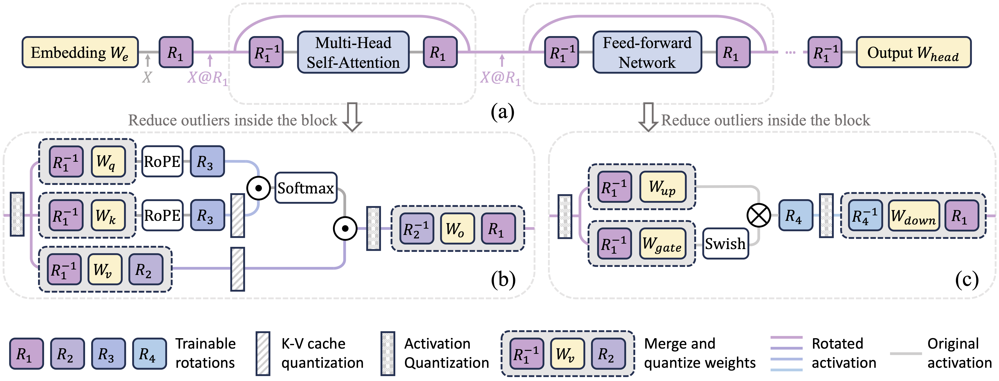

# SpinQuant

This repository contains the code of SpinQuant introduced in our work: "[SpinQuant: LLM Quantization with Learned Rotations](https://arxiv.org/pdf/2405.16406)"

In this work, we found that 

1. Rotation is a principle way to remove outliers in the LLMs and assist quantization; 
2. Not all rotation helps equally and random rotations produce a large variance in quantized models; 
3. Learning rotation with Cayley optimization greatly enhance the final performance.

As a result, SpinQuant narrows the accuracy gap of W4A4KV4 quantization with full precision to merely 2.9 points for the LLaMA-2 7B model on zero-shot reasoning tasks, surpassing LLM-QAT by 19.1 points and SmoothQuant by 25.0 points.

## Citation

If you find our code useful for your research, please consider citing:
    
    @article{liu2024spinquant,
        title={SpinQuant--LLM quantization with learned rotations},
        author={Liu, Zechun and Zhao, Changsheng and Fedorov, Igor and Soran, Bilge and Choudhary, Dhruv and Krishnamoorthi, Raghuraman and Chandra, Vikas and Tian, Yuandong and Blankevoort, Tijmen},
        journal={arXiv preprint arXiv:2405.16406},
        year={2024}
    }
    
## Run

### 1. Requirements:
* python 3.9, pytorch >= 2.0
* pip install -r requirement.txt
* git clone https://github.com/Dao-AILab/fast-hadamard-transform.git  
  cd fast-hadamard-transform  
  pip install .
   
### 2. Steps to run:
Step 1: Optimize Rotation Matrix
* For LLaMA-2 7B/13B and LLaMA-3 8B models:  
  bash `10_optimize_rotation.sh $model_name $w_bit $a_bit $kv_bit`  
  e.g., `bash 10_optimize_rotation.sh meta-llama/Llama-2-7b 4 4 4` for 4-bit weight 4-bit activation and 4-bit kv-cache on Llama-2-7b model.
* For LLaMA-2 70B and LLaMA-3 70B models:  
  bash `11_optimize_rotation_fsdp.sh $model_name $w_bit $a_bit $kv_bit`  
  e.g., `bash 11_optimize_rotation_fsdp.sh meta-llama/Llama-2-70b 4 4 4` for 4-bit weight 4-bit activation and 4-bit kv-cache on Llama-2-70b model.

Step 2: Run PTQ evaluation with optimized rotation  
* bash `2_eval_ptq.sh $model_name $w_bit $a_bit $kv_bit`
  
Others
* If using GPTQ quantization method in Step 2 for quantizing both weight and activations, we optimize the rotation matrices with respect to a network where only activations are quantized.   
  e.g. `bash 10_optimize_rotation.sh meta-llama/Llama-2-7b 16 4 4` followed by `bash 2_eval_ptq.sh meta-llama/Llama-2-7b 4 4 4` with the `--optimized_rotation_path` pointing to the rotation optimized for W16A4KV4.
  
### Arguments 

- `--input_model`: The model name (or path to the weights)
- `--output_rotation_path`: The local path we want to store the oprimized rotation matrix
- `--per_device_train_batch_size`: The batch size for rotation optimization
- `--per_device_eval_batch_size`: The batch size for PPL evaluation
- `--a_bits`: The number of bits for activation quantization
- `--w_bits`: The number of bits for weight quantization
- `--v_bits`: The number of bits for value quantization
- `--k_bits`: The number of bits for key quantization
- `--w_clip`: Whether using the grid search to find best weight clipping range
- `--w_rtn`: Whether we want to use round-to-nearest quantization. If not having `--w_rtn`, we are using GPTQ quantization. 
- `--rotate`: Whether we want to rotate the model
- `--optimized_rotation_path`: The checkpoint path of optimized rotation; Use random rotation if path is not given

 
## Quantized Models
 | Model | LLaMA-3 8B | | LLaMA-3 70B | | LLaMA-2 7B | | LLaMA-2 13B | | LLaMA-2 70B | | 
 | --- | --- | --- | --- | --- | --- | --- | --- | --- | --- | --- |
 | **Method** | *Zero-shot* | *Wiki2* | *Zero-shot* | *Wiki2* | *Zero-shot* | *Wiki2* | *Zero-shot* | *Wiki2* | *Zero-shot* | *Wiki2* |
 | FloatingPoint | 69.6 | 6.1 | 74.5 | 2.8 | 66.9 | 5.5 | 68.3 | 5.0 | 72.9 | 3.3 | 
 | *W4A16KV16* | | | | | | | | | | |
 | RTN | 65.4 | 7.8 | 35.5 | 1e5 | 63.6 | 7.2 | 57.9 | 6.4 | 69.2 | 4.6 | 
 | SmoothQuant | 61.0 | 10.7 | 66.9 | 12.0 | 59.1 | 7.5 | 63.3 | 6.1 | 70.2 | 4.1 | 
 | LLM-QAT | 67.7 | 7.1 | -- | -- | 64.9 | 5.9 | -- | -- | -- | -- | 
 | GPTQ | 66.5 | 7.2 | 35.7 | 1e5 | 64.5 | 11.3 | 64.7 | 5.6 | 71.9 | 3.9 | 
 | QuaRot | 68.4 | **6.4** | 70.3 | 7.9 | 65.8 | **5.6** | 68.3 | **5.0** | 72.2 | **3.5** | 
 | SpinQuant | **68.5** | **6.4** | **71.6** | **4.8** | **65.9** | **5.6** | **68.5** | **5.0** | **72.6** | **3.5** | 
 | *W4A4KV16* | | | | | | | | | | |
 | RTN | 38.5 | 9e2 | 35.6 | 1e5 | 35.6 | 2e3 | 35.3 | 7e3 | 35.1 | 2e5 | 
 | SmoothQuant | 40.3 | 8e2 | 55.3 | 18.0 | 41.8 | 2e2 | 44.9 | 34.5 | 64.6 | 57.1 | 
 | LLM-QAT | 44.9 | 42.9 | -- | -- | 47.8 | 12.9 | -- | -- | -- | -- | 
 | GPTQ | 37.0 | 9e2 | 35.3 | 1e5 | 36.8 | 8e3 | 35.3 | 5e3 | 35.5 | 2e6 | 
 | QuaRot | 63.8 | 7.9 | 65.4 | 20.4 | 63.5 | 6.1 | 66.7 | 5.4 | 70.4 | 3.9 | 
 | SpinQuant | **65.8** | **7.1** | **69.5** | **5.5** | **64.1** | **5.9** | **67.2** | **5.2** | **71.0** | **3.8** | 
 | *W4A4KV4* | | | | | | | | | | |
 | RTN | 38.2 | 1e3 | 35.2 | 1e5 | 37.1 | 2e3 | 35.4 | 7e3 | 35.0 | 2e5 | 
 | SmoothQuant | 38.7 | 1e3 | 52.4 | 22.1 | 39.0 | 6e2 | 40.5 | 56.6 | 55.9 | 10.5 | 
 | LLM-QAT | 43.2 | 52.5 | -- | -- | 44.9 | 14.9 | -- | -- | -- | -- | 
 | GPTQ | 37.1 | 1e3 | 35.1 | 1e5 | 36.8 | 9e3 | 35.2 | 5e3 | 35.6 | 1e6 | 
 | QuaRot | 63.3 | 8.0 | 65.1 | 20.2 | 62.5 | 6.4 | 66.2 | 5.4 | 70.3 | 3.9 | 
 | SpinQuant | **65.2** | **7.3** | **69.3** | **5.5** | **64.0** | **5.9** | **66.9** | **5.3** | **71.2** | **3.8** | 

You can download the optimized rotation matrices [here](https://drive.google.com/drive/folders/1R2zix4qeXBjcmgnJN1rny93cguJ4rEE8?usp=sharing).

## Acknowledgement

This code is partially based on [HuggingFace transformers](https://github.com/huggingface/transformers), [QuaRot](https://github.com/spcl/QuaRot) and [Optimization-on-Stiefel-Manifold-via-Cayley-Transform](https://github.com/JunLi-Galios/Optimization-on-Stiefel-Manifold-via-Cayley-Transform/tree/master).

## Contact

Zechun Liu, Reality Labs, Meta Inc (zechunliu at meta dot com)

Changsheng Zhao, Reality Labs, Meta Inc (cszhao at meta dot com)

## License

BiT is CC-BY-NC 4.0 licensed as of now.

